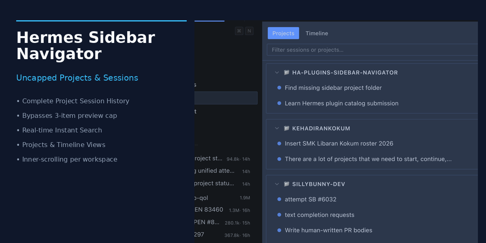
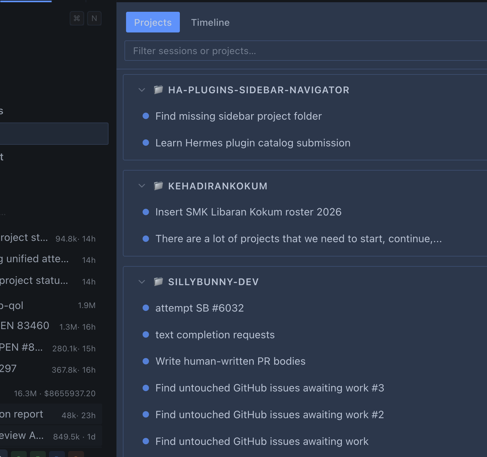

# HA-Plugins-sidebar-navigator



Full-power project and session navigator for **Hermes Desktop**. Bypasses the default 3-session sidebar overview limit and gives you smooth, scrollable, searchable access to all conversations.

---

## The Problem
In Hermes Desktop, the default sidebar project view limits previews to **3 sessions** per project (`PROJECT_PREVIEW_COUNT = 3`). As your project grows to dozens or hundreds of sessions, older sessions are hidden and impossible to browse or scroll without tedious search terms.

## The Solution: Sidebar Navigator
**Sidebar Navigator** is a lightweight, contribution-driven edge plugin that runs entirely on `@hermes/plugin-sdk` without modifying core files:
- **No 3-Session Cap:** Retrieves complete project trees and queries `projects.project_sessions` up to 2,000 sessions per project.
- **Inner-Scrolling Project Cards:** Each project displays its full session count and has an inner-scrollable list with smooth scrolling.
- **Instant Search:** Live filter queries titles, preview snippets, and session IDs as you type.
- **Projects & Timeline Modes:** Switch between grouped project trees and a flat chronological timeline of all recent chats.
- **One-Click Jump:** Direct navigation to `#/<sessionId>` in the main conversation workspace.

---

## How It Works (Step-by-Step)

### 1. Launch Navigator
Click **Navigator** in the left sidebar menu (or press `Cmd/Ctrl + K` and search for *"Sidebar Navigator"*).



### 2. Browse by Project
Projects are listed with their folder badges, session counts, and expandable conversation lists. 

### 3. Filter or Switch to Timeline
Use the search bar at the top to filter across all projects simultaneously, or toggle **Timeline** to see every conversation newest-first.

---

## Installation

### Via Curated Hermes Plugin Catalog
```bash
hermes plugins install ha-sidebar-navigator
```

### Manual / Developer Mode
Copy `desktop-plugin/` (or symlink it) into your Hermes plugins directory:
```bash
mkdir -p ~/.hermes/plugins/ha-sidebar-navigator
cp -r desktop-plugin/* ~/.hermes/plugins/ha-sidebar-navigator/
```
Or install directly from GitHub:
```bash
hermes plugins install https://github.com/badiyee85/HA-Plugins-sidebar-navigator --subdir desktop-plugin
```
Press `Cmd/Ctrl + K` in Hermes Desktop and run **Reload desktop plugins**.

---

## Architecture & Compatibility
- **Runtime:** Native ESM loaded by Hermes Desktop via `@hermes/plugin-sdk`.
- **Styling:** Adheres strictly to Hermes host theme tokens (`var(--ui-text-*)`, `var(--ui-bg-*)`, `var(--chrome-action-hover)`).
- **Security:** Zero self-updating code; pure client-side view layer.
- **License:** MIT.
